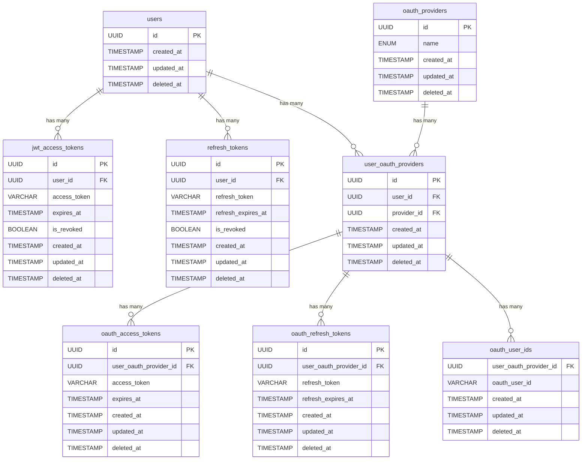

# 基本設計/RDB

```mermaid

erDiagram

    users {
        UUID id PK
        TIMESTAMP created_at
        TIMESTAMP updated_at
        TIMESTAMP deleted_at
    }

    jwt_access_tokens {
        UUID id PK
        UUID user_id FK
        VARCHAR access_token
        TIMESTAMP expires_at
        BOOLEAN is_revoked
        TIMESTAMP created_at
        TIMESTAMP updated_at
        TIMESTAMP deleted_at
    }

    refresh_tokens {
        UUID id PK
        UUID user_id FK
        VARCHAR refresh_token
        TIMESTAMP refresh_expires_at
        BOOLEAN is_revoked
        TIMESTAMP created_at
        TIMESTAMP updated_at
        TIMESTAMP deleted_at
    }

    oauth_providers {
        UUID id PK
        ENUM name
        TIMESTAMP created_at
        TIMESTAMP updated_at
        TIMESTAMP deleted_at
    }

    oauth_access_tokens {
        UUID id PK
        UUID user_oauth_provider_id FK
        VARCHAR access_token
        TIMESTAMP expires_at
        TIMESTAMP created_at
        TIMESTAMP updated_at
        TIMESTAMP deleted_at
    }

    oauth_refresh_tokens {
        UUID id PK
        UUID user_oauth_provider_id FK
        VARCHAR refresh_token
        TIMESTAMP refresh_expires_at
        TIMESTAMP created_at
        TIMESTAMP updated_at
        TIMESTAMP deleted_at
    }

    oauth_user_ids {
        UUID user_oauth_provider_id FK
        VARCHAR oauth_user_id
        TIMESTAMP created_at
        TIMESTAMP updated_at
        TIMESTAMP deleted_at
    }

    user_oauth_providers {
        UUID id PK
        UUID user_id FK
        UUID provider_id FK
        TIMESTAMP created_at
        TIMESTAMP updated_at
        TIMESTAMP deleted_at
    }

    %% Relationships
    users ||--o{ jwt_access_tokens : "has many"
    users ||--o{ refresh_tokens : "has many"
    users ||--o{ user_oauth_providers : "has many"
    oauth_providers ||--o{ user_oauth_providers : "has many"
    user_oauth_providers ||--o{ oauth_access_tokens : "has many"
    user_oauth_providers ||--o{ oauth_refresh_tokens : "has many"
    user_oauth_providers ||--o{ oauth_user_ids : "has many"


```
