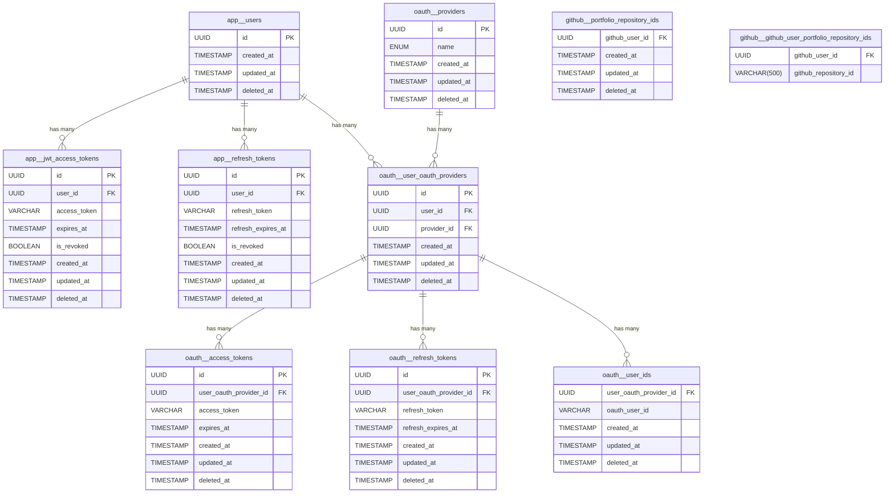

# 基本設計/RDB

```mermaid

erDiagram

    %% App schema tables
    app__users {
        UUID id PK
        TIMESTAMP created_at
        TIMESTAMP updated_at
        TIMESTAMP deleted_at
    }

    app__jwt_access_tokens {
        UUID id PK
        UUID user_id FK
        VARCHAR access_token
        TIMESTAMP expires_at
        BOOLEAN is_revoked
        TIMESTAMP created_at
        TIMESTAMP updated_at
        TIMESTAMP deleted_at
    }

    app__refresh_tokens {
        UUID id PK
        UUID user_id FK
        VARCHAR refresh_token
        TIMESTAMP refresh_expires_at
        BOOLEAN is_revoked
        TIMESTAMP created_at
        TIMESTAMP updated_at
        TIMESTAMP deleted_at
    }

    %% OAuth schema tables
    oauth__providers {
        UUID id PK
        ENUM name
        TIMESTAMP created_at
        TIMESTAMP updated_at
        TIMESTAMP deleted_at
    }

    oauth__access_tokens {
        UUID id PK
        UUID user_oauth_provider_id FK
        VARCHAR access_token
        TIMESTAMP expires_at
        TIMESTAMP created_at
        TIMESTAMP updated_at
        TIMESTAMP deleted_at
    }

    oauth__refresh_tokens {
        UUID id PK
        UUID user_oauth_provider_id FK
        VARCHAR refresh_token
        TIMESTAMP refresh_expires_at
        TIMESTAMP created_at
        TIMESTAMP updated_at
        TIMESTAMP deleted_at
    }

    oauth__user_ids {
        UUID user_oauth_provider_id FK
        VARCHAR oauth_user_id
        TIMESTAMP created_at
        TIMESTAMP updated_at
        TIMESTAMP deleted_at
    }

    oauth__user_oauth_providers {
        UUID id PK
        UUID user_id FK
        UUID provider_id FK
        TIMESTAMP created_at
        TIMESTAMP updated_at
        TIMESTAMP deleted_at
    }

    github__portfolio_repository_ids {
        UUID github_user_id FK
        TIMESTAMP created_at
        TIMESTAMP updated_at
        TIMESTAMP deleted_at
    }

    github__github_user_portfolio_repository_ids {
        UUID github_user_id FK
        VARCHAR(500) github_repository_id
    }

    %% Relationships
    app__users ||--o{ app__jwt_access_tokens : "has many"
    app__users ||--o{ app__refresh_tokens : "has many"
    app__users ||--o{ oauth__user_oauth_providers : "has many"
    oauth__providers ||--o{ oauth__user_oauth_providers : "has many"
    oauth__user_oauth_providers ||--o{ oauth__access_tokens : "has many"
    oauth__user_oauth_providers ||--o{ oauth__refresh_tokens : "has many"
    oauth__user_oauth_providers ||--o{ oauth__user_ids : "has many"


```
